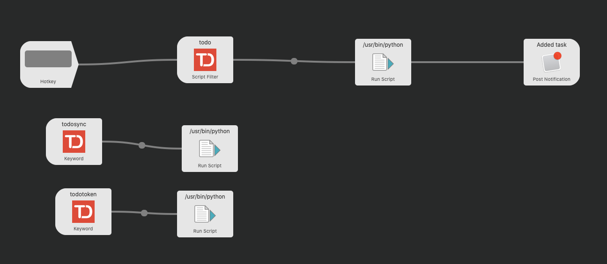

# Todoist workflow for Alfred

Workflow for Alfred which lets you to direct your added tasks to projects (by using #projectId or [projectId] where workflow will autosuggest projectId) and to add to projects lables (by @labelId, with autosuggest for labels).

You need Personal API Token you can find/generate [here](https://todoist.com/prefs/integrations)

To "install" click [here](./TodoistToProject.alfredworkflow)

## **How to use?**

This part is needed only for the first time:
* Install it (to do it click [here](./TodoistToProject.alfredworkflow))
* get your Personal API Token [here](https://todoist.com/prefs/integrations)
* copy it
* use Alfred (usually by Option-Space) with command todotoken \<yourToken\>

To add new task use:
todo \<yourTask\>

## **How to make modifications?**

Here you can see how it look in Alfred

Those "map" to files in src folder.
* First Script Filter maps to [filterScript.py](./src/filterScript.py) - this one shows autosuggestions
* First Run Script maps to [filterScript.py](./src/sendScript.py) - this one sends your task to Todoist
* Second Run Script maps to [synScript.py](./src/syncScript.py) - this one syncs projects and labels (so downloads those from Todoist)
* Third Run Script maps to [tokenScript.py](./src/tokenScript.py) - this on stores Personal API Token (you may get it [here](https://todoist.com/prefs/integrations))

Icon image taken from https://github.com/rbnh/todoist-alfred-workflow
